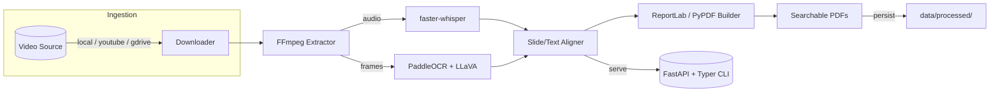

 # Video Lectures to Searchable PDFs

Pipeline for turning webinar-style videos into searchable lecture artifacts:

- OCR-driven slide PDF
- Whisper transcript PDF
- Slide-aligned combined PDF

## Quickstart

```bash
python -m venv .venv && source .venv/bin/activate
pip install -e .
vlsp --help
```

## CLI Usage

```bash
vlsp run --type local --source /path/to/webinar.mp4
vlsp run --type youtube --source https://youtu.be/xxxx
vlsp run --type gdrive --source https://drive.google.com/file/d/ID/view
```

Outputs land in `data/processed/<video_id>/`.

## API Server

```bash
uvicorn app.server:app --reload --port 8080
```

POST payload:

```json
{
  "source_type": "youtube",
  "source": "https://youtu.be/... "
}
```

## Architecture Overview



The CLI (`vlsp`) and FastAPI server share the same pipeline, so you can drive the workflow via command line, HTTP, or by importing the pipeline directly in Python.

## End-to-End Workflow

1. **Ingestion**: Video is pulled from the specified target (`local`, `youtube`, or `gdrive`). Metadata such as ID, title, and duration is captured for downstream file naming.
2. **Media Extraction**: FFmpeg splits the video into a high-quality WAV track and evenly spaced video frames with timestamps.
3. **Speech + Slide Text Understanding**:
   - `faster-whisper` produces bilingual-friendly transcripts and per-segment timestamps.
   - PaddleOCR extracts slide text from frames, while LLaVA handles dense visual descriptions when text is light.
4. **Alignment**: Transcript chunks are matched to their corresponding slide frames using temporal overlap and cosine similarity on embeddings.
5. **PDF Generation**:
   - **OCR-driven slide PDF** for crisp slide reproduction with searchable overlays.
   - **Whisper transcript PDF** containing time-linked dialogues.
   - **Combined PDF** merges slides and transcripts per page for study-ready notes.
6. **Delivery**: Artifacts are written to `data/processed/<video_id>/` and optionally surfaced via the FastAPI endpoint.

## Component Details

1. Multi-source ingestion (local path, YouTube URL, Google Drive URL)
2. Media extraction via FFmpeg (audio WAV + timestamped frames)
3. GPU-friendly AI models:
   - `faster-whisper` (Whisper Large V3)
   - PaddleOCR + LLaVA (via 🤗 Transformers) for slide text
4. PDF creation using ReportLab + PyPDF
5. Slide-by-slide synchronization with transcript blocks
6. FastAPI service & Typer CLI orchestrating the workflow

See `docs/models.md` for recommended checkpoints and VRAM needs.